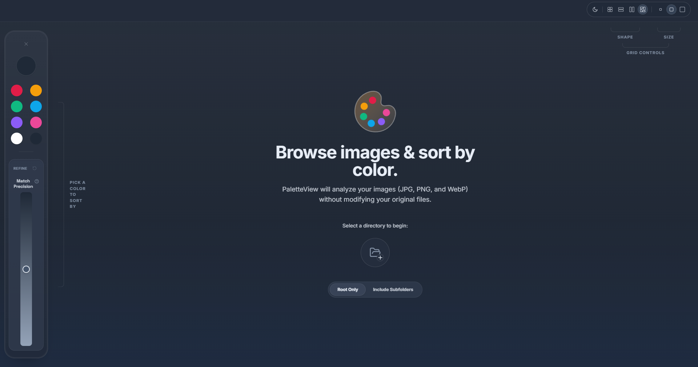
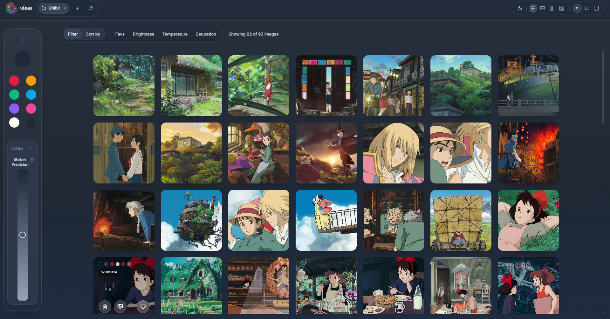
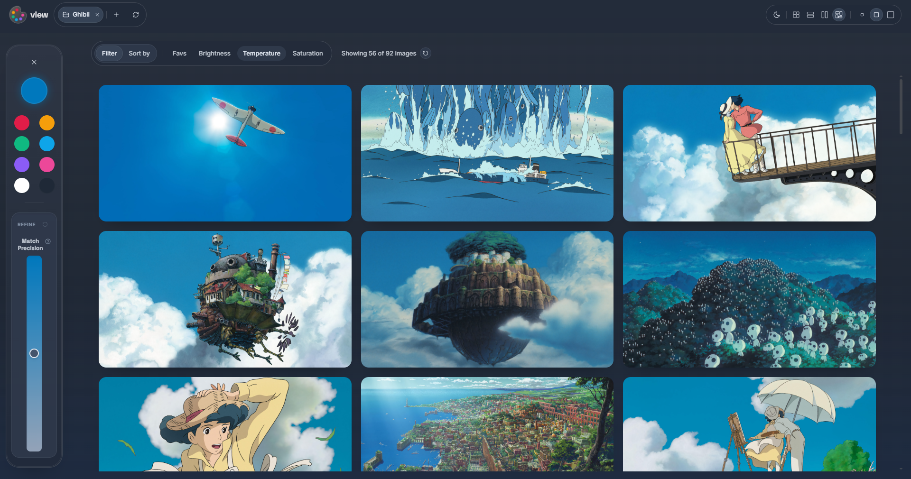
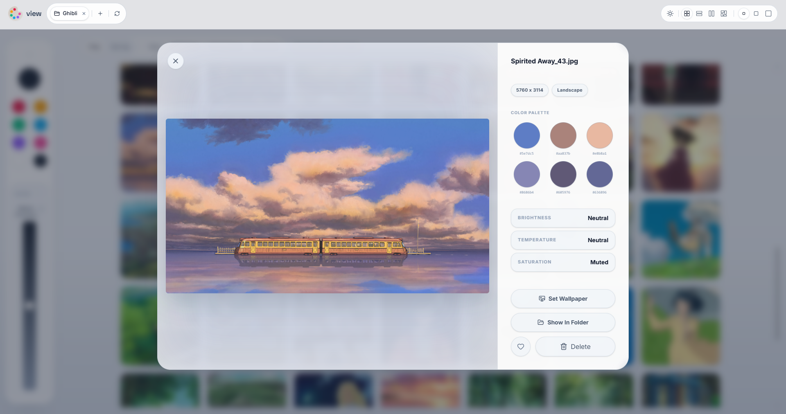

# PaletteView

**Demo**: https://sibsi.github.io/palette-ranking/

PaletteView is a Tauri desktop app built to make image browsing more visual than traditional folder-based navigation. Instead of sorting by file name or date, it analyzes the color characteristics of your images, allowing you to sort and group them based on **perceptual similarity**.

The project idea came from organizing my own large wallpaper collection. I would manually order the images based on their colors & brightness, or I would search for a specific color, which was tedious. PaletteView was built to bridge that gap, allowing you to sort and also find a "cold-toned image with orange in it" in seconds.

## Features

- **Intelligent Color Extraction**: generates a color palette for every image
- **Perceptual Sorting**: uses Oklab/Oklch rather than standard RGB
- **Visual Tone Analysis**: sorts and filters by brightness, saturation, and color temperature

## Tech Stack

- **Frontend:** React, TypeScript, Tailwind CSS v4
- **Backend (Image Processing):** Rust
- **Color Libraries:** `palette`, `culori`

## How It Works

PaletteView uses a Rust-based analysis pipeline that keeps browsing fluid, even with large libraries.

1. Uses `rayon` to scan folders and process images **parallelized**. Pipeline is optimized with image downscaling, fixed cluster limits, and early convergence.
2. Generates color palettes using **weighted K-Means clustering in Oklab space**. Centroids are initialized with a farthest-first strategy and refined iteratively, to capture both dominant and visually important accent colors.
3. The app has a broad internal palette for precise matching while also keeping a curated, aesthetic palette for the UI.
4. Thumbnails and analysis results are stored in a local JSON cache, ensuring that subsequent launches are instant.

## Showcases

| Start Page | Gallery View |
| :---: | :---: |
|  |  |

| Color Filter | Image Detail |
| :---: | :---: |
|  |  |

## License

This project is licensed under the MIT License.
